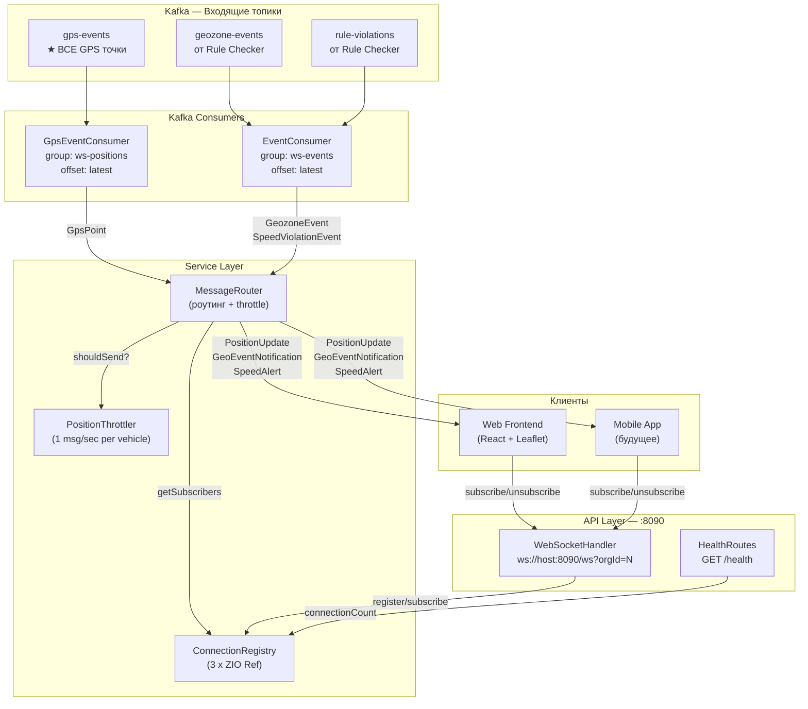
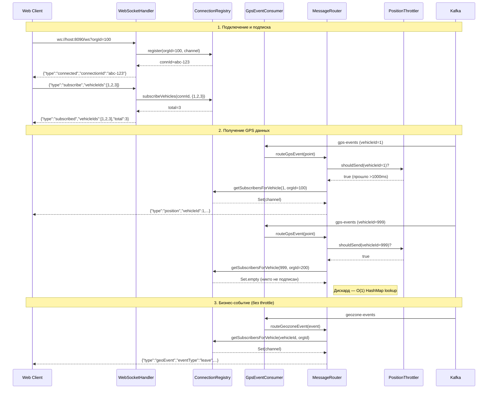
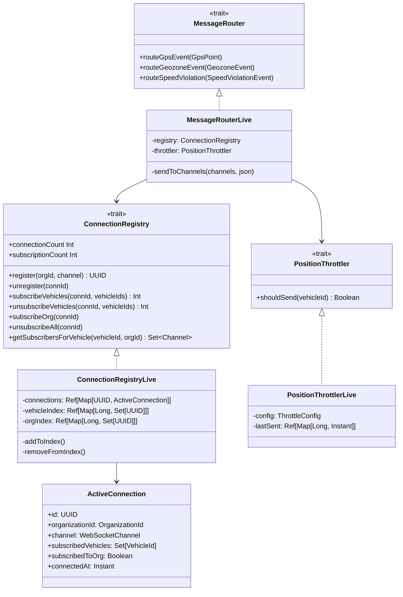
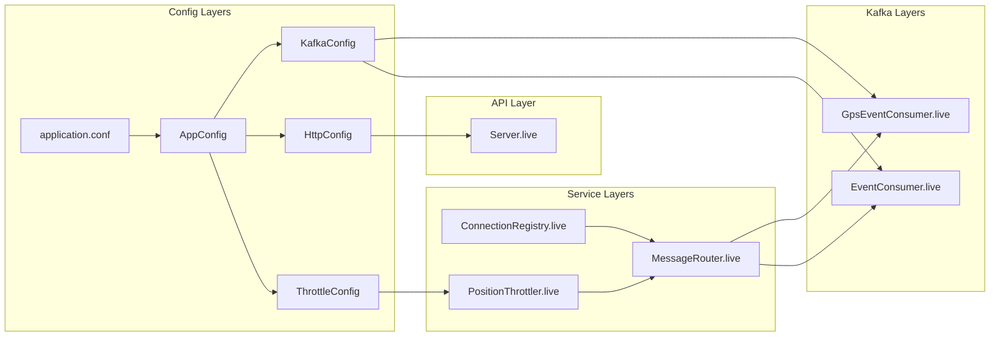
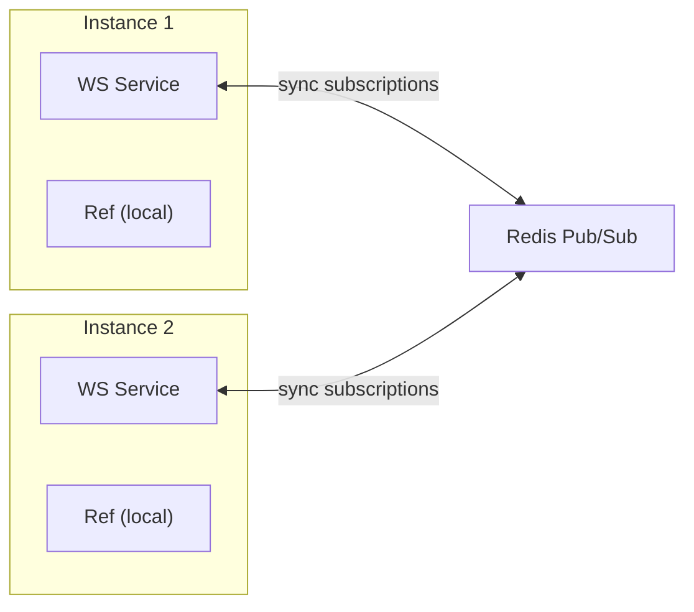

# WebSocket Service — Архитектура v1.1

> Тег: `АКТУАЛЬНО` | Обновлён: `2026-03-03` | Версия: `1.1`

## Обзор

WebSocket Service — микросервис real-time доставки GPS-данных и бизнес-событий
до веб-клиентов через WebSocket. Реализует **Smart Consumer** паттерн:
читает ВСЕ GPS-точки и события из Kafka, фильтрует in-memory по активным подпискам,
доставляет только подписчикам.

## Ключевые метрики

| Компонент | Описание |
|---|---|
| **3 Kafka топика** | gps-events (consume), geozone-events (consume), rule-violations (consume) |
| **2 consumer группы** | ws-positions (GPS), ws-events (бизнес-события) |
| **2 HTTP endpoints** | `/ws` (WebSocket), `/health` (REST) |
| **3 типа ServerMessage** | PositionUpdate, GeoEventNotification, SpeedAlert |
| **5 типов ClientMessage** | Subscribe, SubscribeOrg, Unsubscribe, UnsubscribeAll, Ping |
| **In-memory state** | 3 ZIO Ref: connections, vehicleIndex, orgIndex |

## Общая архитектура



## Smart Consumer Pattern



## Подписочная модель — Dual Index



## ZIO Layer граф



## Потоки данных

### GPS позиция (hot path, throttled)

```
Kafka gps-events → GpsEventConsumer.run
  → record.value.fromJson[GpsPoint]
    → MessageRouter.routeGpsEvent(point)
      → PositionThrottler.shouldSend(vehicleId)
        → false: discard (слишком рано)
        → true:
          → ConnectionRegistry.getSubscribersForVehicle(vehicleId, orgId)
            → vehicleIndex + orgIndex → Set[WebSocketChannel]
              → sendToChannels(channels, PositionUpdate.toJson)
```

### Бизнес-событие (immediate, no throttle)

```
Kafka geozone-events → EventConsumer.run
  → record.value.fromJson[GeozoneEvent]
    → MessageRouter.routeGeozoneEvent(event)
      → ConnectionRegistry.getSubscribersForVehicle(vehicleId, orgId)
        → sendToChannels(channels, GeoEventNotification.toJson)

Kafka rule-violations → EventConsumer.run
  → record.value.fromJson[SpeedViolationEvent]
    → MessageRouter.routeSpeedViolation(event)
      → ConnectionRegistry.getSubscribersForVehicle(vehicleId, orgId)
        → sendToChannels(channels, SpeedAlert.toJson)
```

## Масштабирование

### Текущая реализация (MVP)

- **Single instance** — все подписки в in-memory ZIO Ref
- До ~1000 одновременных WS соединений на один инстанс
- Ограничение: при 2+ инстансах подписки не синхронизированы

---

## Анализ производительности и ограничений

### Оценка потребления памяти

#### Per-connection (ActiveConnection)

| Компонент | Размер | Примечание |
|---|---|---|
| UUID | ~48 bytes | 2 longs + object wrapper |
| OrganizationId (Long) | 8 bytes | opaque type |
| WebSocketChannel (ref) | 8 bytes | ссылка на Netty channel |
| Set[VehicleId] (пустой) | ~40 bytes | Scala immutable Set |
| Boolean | ~4 bytes | subscribedToOrg |
| Instant | ~16 bytes | connectedAt |
| Case class overhead | ~32 bytes | JVM object header |
| **Итого (без подписок)** | **~160 bytes** | |
| Per vehicle в подписке | ~72 bytes | boxed Long + Set node |

#### Netty / zio-http per WebSocket

| Компонент | Размер | Примечание |
|---|---|---|
| Netty channel + buffers | ~4-16 KB | без TLS |
| TLS context (если есть) | ~20-50 KB | SSL session |
| ZIO fiber | ~256 bytes | lightweight |
| **Итого per OS connection** | **~5-20 KB** | без TLS: ~5 KB |

#### Сводка по сценариям

| Пользователей | ТС/подписка | Registry (Ref) | Netty/ZIO | **Итого WS** | JVM Heap |
|:---:|:---:|---:|---:|---:|---:|
| 100 | 10 | ~0.2 MB | ~1 MB | **~1.2 MB** | 256 MB |
| 500 | 20 | ~1.8 MB | ~8 MB | **~10 MB** | 512 MB |
| 1,000 | 50 | ~8.8 MB | ~15 MB | **~24 MB** | 1 GB |
| 5,000 | 50 | ~44 MB | ~75 MB | **~119 MB** | 2 GB |
| 10,000 | 50 | ~88 MB | ~150 MB | **~238 MB** | 4 GB |

> **Вывод:** память НЕ является bottle-neck. Даже 10K пользователей ≈ 238 MB.
> JVM heap 2 GB достаточно для 5K+ одновременных соединений.

### Latency: Kafka → WS доставка

```
Трекер → TCP → CM → Kafka publish: ~5-10ms
Kafka → WS consumer fetch:         ~1-500ms (fetch.max.wait.ms=500)
JSON deserialize (GpsPoint):        ~10μs
Registry lookup (Ref.get):          ~1μs
Throttle check (Ref.get + modify):  ~2μs
JSON serialize (ServerMessage):     ~5μs
WS frame send (per subscriber):     ~50μs
─────────────────────────────────
Kafka fetch wait (amortized):       ~5-50ms (busy stream)
End-to-end pipeline:                ~20-100ms (p95)
                                    ~100-550ms (p99, cold fetch)
```

| Метрика | Best case | Typical (p95) | Worst case (p99) |
|---|---|---|---|
| **Kafka → WS** (1 subscriber) | ~67μs | ~50ms | ~500ms |
| **End-to-end** (tracker → browser) | ~10ms | ~60ms | ~600ms |

> **Throttle default:** 1000ms на vehicleId. Пользователь получает ≤1 обновление/сек
> на одно ТС. Это компромисс: снижает нагрузку на WS и браузер (Leaflet).

### Throughput (пропускная способность)

| Сценарий | GPS points/sec | WS msgs/sec out | Bandwidth/subscriber |
|---|:---:|:---:|---:|
| 100 ТС, 1 user | 100 | ≤100 | ~20 KB/s |
| 1,000 ТС, 10 users | 1,000 | ≤10,000 | ~200 KB/s |
| 10,000 ТС, 100 users | 10,000 | ≤1M | ~2 MB/s (per user 10K ТС) |
| 10,000 ТС, 100 users | 10,000 | ≤100,000 | ~20 KB/s (per user 100 ТС) |

> **Типичный кейс:** диспетчер наблюдает 50-200 ТС.
> При throttle 1 сек: 50-200 msg/sec, ~10-40 KB/s — комфортно.

### Лимиты одного инстанса

| Ресурс | Лимит | Фактор |
|---|---:|---|
| OS file descriptors | ~65,536 | `ulimit -n` (настроить!) |
| ZIO fibers | ~миллионы | легковесная конкурентность |
| Netty event loop | ~10K-50K conn | зависит от message rate |
| JVM heap 2 GB | ~5,000 conn | при 50 ТС/подписку |
| Kafka consumer (1 thread) | ~100K msg/sec | JSON deserialize bottleneck |

**Практический лимит MVP: 1,000–5,000 WS соединений на инстанс.**

### Bottleneck-сценарии

| # | Bottleneck | Когда | Решение |
|---|---|---|---|
| 1 | **CPU** (JSON serialize) | >100K msgs/sec | Batch serialization, кэш JSON |
| 2 | **Memory** | >5K conn с 50+ ТС | Увеличить heap, sharding |
| 3 | **Network** | >500 users × 10K ТС | Throttle жёстче, pagination подписок |
| 4 | **Kafka lag** | consumer не успевает | Увеличить партиции, parallel consume |
| 5 | **File descriptors** | >10K WS connections | `ulimit -n 100000` |

--- Plan (post-MVP): горизонтальное масштабирование



- **Redis Pub/Sub** для синхронизации подписок между инстансами
- Sticky sessions через API Gateway (привязка WS к инстансу)
- Каждый инстанс потребляет ВСЕ партиции (broadcast, НЕ sharding)
