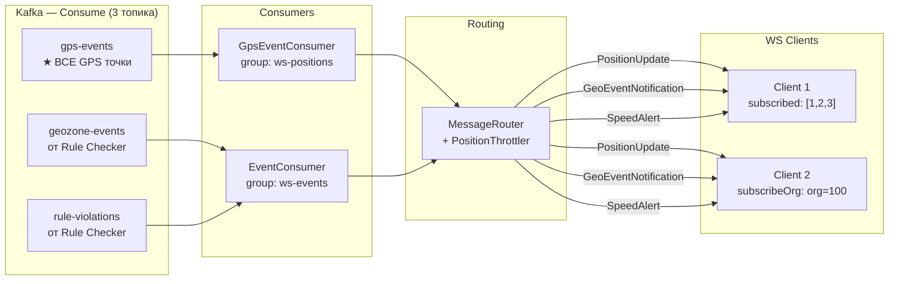

# WebSocket Service — Kafka v1.0

> Тег: `АКТУАЛЬНО` | Обновлён: `2026-03-03` | Версия: `1.0`

> Полное описание всех топиков → [infra/kafka/TOPICS.md](../../../infra/kafka/TOPICS.md)

## Общая схема маршрутизации



**Важно:** WebSocket Service **только потребляет** Kafka топики. Он ничего не публикует.

---

## Потребляет (Consume) — 3 топика

### gps-events

GPS точки от Connection Manager. ВСЕ точки, включая стоянки и отфильтрованные.

| Параметр | Значение |
|---|---|
| Consumer Group | `ws-positions` |
| Auto Offset Reset | `latest` (только реальное время) |
| Max Poll Records | `500` |
| Модель | `GpsPoint` |
| Throttle | Да — 1 msg/sec per vehicleId |
| Объём | ~10K msg/sec при 10K трекеров |

**Почему `latest`:** нас не интересует история — только real-time позиции.
При рестарте сервиса клиенты переподключаются и получают свежие данные.

**Почему отдельный consumer group:** независимо от History Writer (`history-writer`)
и Rule Checker (`rule-checker`). У каждого свой offset. При лаге WS Service
не мешает записи истории.

### geozone-events

События входа/выхода из геозон от Rule Checker.

| Параметр | Значение |
|---|---|
| Consumer Group | `ws-events` |
| Auto Offset Reset | `latest` |
| Max Poll Records | `100` |
| Модель | `GeozoneEvent` |
| Throttle | Нет — доставка немедленная |
| Объём | ~10-50 msg/sec |

### rule-violations

Нарушения скорости от Rule Checker.

| Параметр | Значение |
|---|---|
| Consumer Group | `ws-events` |
| Auto Offset Reset | `latest` |
| Max Poll Records | `100` |
| Модель | `SpeedViolationEvent` |
| Throttle | Нет — доставка немедленная |
| Объём | ~5-20 msg/sec |

**Один consumer group для обоих:** `ws-events` — подписываемся на оба топика
в одном consumer, роутим по `record.record.topic()`. Общий consumer group
позволяет обрабатывать оба типа событий в одном потоке.

---

## Публикует (Produce) — 0 топиков

WebSocket Service **ничего не публикует в Kafka**.
Он является конечной точкой доставки данных до клиентов.

---

## Маршрутизация сообщений

### GPS → PositionUpdate

```
Kafka (gps-events) 
  → GpsEventConsumer.run (deserialize GpsPoint)
    → MessageRouter.routeGpsEvent(point)
      → PositionThrottler.shouldSend(vehicleId) -- throttle 1 sec
        → true? → ConnectionRegistry.getSubscribersForVehicle(vehicleId, orgId)
          → vehicleIndex[vehicleId] ∪ orgIndex[orgId]
            → sendToChannels(channels, PositionUpdate.toJson)
```

### GeozoneEvent → GeoEventNotification

```
Kafka (geozone-events)
  → EventConsumer.run (deserialize GeozoneEvent)
    → MessageRouter.routeGeozoneEvent(event)
      → ConnectionRegistry.getSubscribersForVehicle(vehicleId, orgId)
        → sendToChannels(channels, GeoEventNotification.toJson)
```

### SpeedViolation → SpeedAlert

```
Kafka (rule-violations)
  → EventConsumer.run (deserialize SpeedViolationEvent)
    → MessageRouter.routeSpeedViolation(event)
      → ConnectionRegistry.getSubscribersForVehicle(vehicleId, orgId)
        → sendToChannels(channels, SpeedAlert.toJson)
```

---

## Consumer Settings

### GpsEventConsumer

```scala
ConsumerSettings(List(kafkaConfig.bootstrapServers))
  .withGroupId("ws-positions")
  .withProperty("auto.offset.reset", "latest")
  .withProperty("max.poll.records", "500")
```

### EventConsumer

```scala
ConsumerSettings(List(kafkaConfig.bootstrapServers))
  .withGroupId("ws-events")
  .withProperty("auto.offset.reset", "latest")
  .withProperty("max.poll.records", "100")
```

---

## Зависимости от других сервисов

| Сервис | Топик | Что публикует | Что WS получает |
|---|---|---|---|
| **Connection Manager** | `gps-events` | Все GPS точки (GpsEventMessage) | GpsPoint → PositionUpdate |
| **Rule Checker** | `geozone-events` | Enter/Leave события | GeozoneEvent → GeoEventNotification |
| **Rule Checker** | `rule-violations` | Превышения скорости | SpeedViolationEvent → SpeedAlert |

## Совместимость форматов

Доменные модели WS Service (Entities.scala) совместимы с моделями продюсеров:
- `GpsPoint` ← совместим с `GpsEventMessage` из CM
- `GeozoneEvent` ← совместим с форматом Rule Checker
- `SpeedViolationEvent` ← совместим с форматом Rule Checker

Все модели используют `derives JsonCodec` для автоматической де/сериализации.
